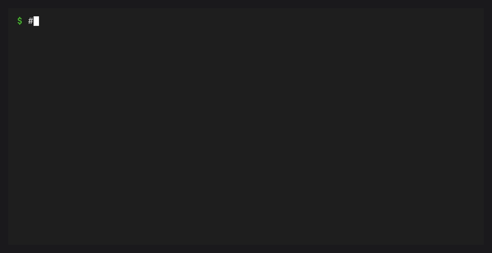

# Inspect Logs and Events



## Logs

Each service writes stdout and stderr to a service log file:

```bash
cb logs package-cache
cb logs package-cache --lines 200
cb logs package-cache --previous
cb logs package-cache --follow
```

JSON output returns a stable object:

```bash
cb logs package-cache --json
```

Follow mode with JSON emits JSON Lines:

```bash
cb logs package-cache --follow --json
```

## Events

Events are append-only records for broker lifecycle, service lifecycle,
health transitions, restart scheduling, enable/disable changes, and events
emitted by providers.

```bash
cb events
cb events --lines 100
cb events --follow
cb events --follow --json
```

Provider plugins can record events without starting the broker:

```python
from conda_broker.client import emit_event

emit_event("package_cache.warmed", service="package-cache", message="ready")
```
