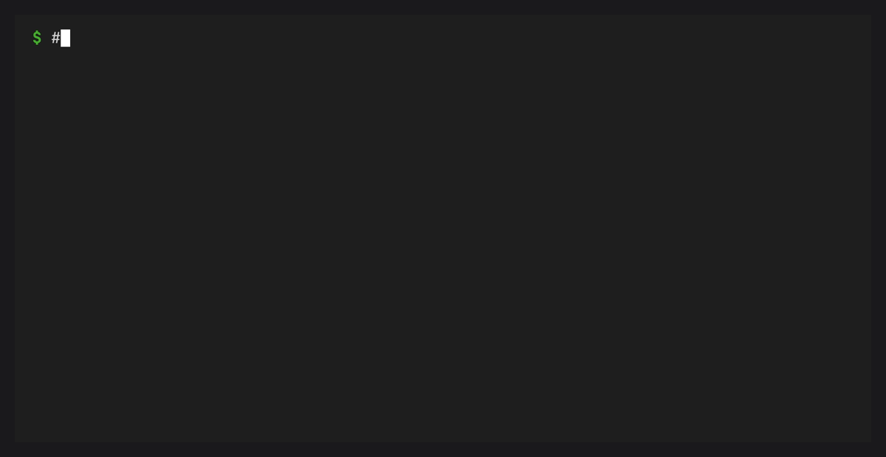

# JSON Output

Commands that report state support `--json`. JSON output is intended for
automation and remains separate from Rich human output.



## Status

```json
{
  "broker": {
    "running": true,
    "started": false
  },
  "services": [
    {
      "name": "presto",
      "summary": "Local long-running conda solver API",
      "source": "conda-presto",
      "runtime": "process",
      "enabled": true,
      "state": "running",
      "running": true,
      "pid": 12345,
      "exit_code": null,
      "started_at": "2026-07-03T12:00:00+00:00",
      "restart_count": 0,
      "health": "healthy"
    }
  ]
}
```

## List

```json
{
  "services": [
    {
      "name": "presto",
      "summary": "Local long-running conda solver API",
      "source": "conda-presto",
      "runtime": "process",
      "start_policy": "manual",
      "restart_policy": "on-failure"
    }
  ],
  "enabled": ["presto"]
}
```

## Logs Follow

`cb logs SERVICE --follow --json` emits JSON Lines:

```json
{"service": "presto", "line": "ready"}
{"service": "presto", "line": "handled solve request"}
```

## Events Follow

`cb events --follow --json` emits one event object per line.

## Development Harness

`cb dev validate`, `cb dev run`, and `cb dev test` return one
`conformance` object. `cb dev report` returns a report object with a
`results` list. See [](dev-harness.md) for the full shape.
